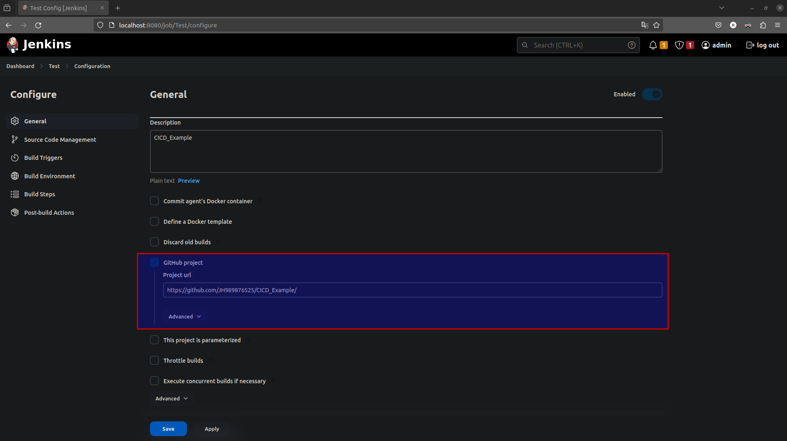
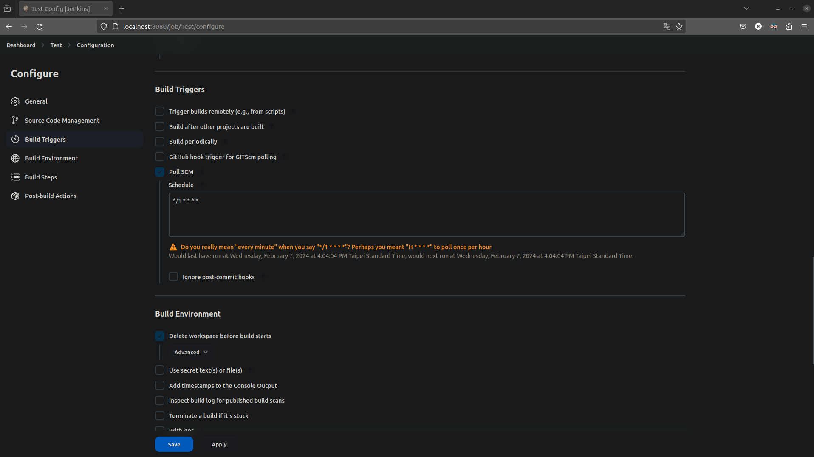
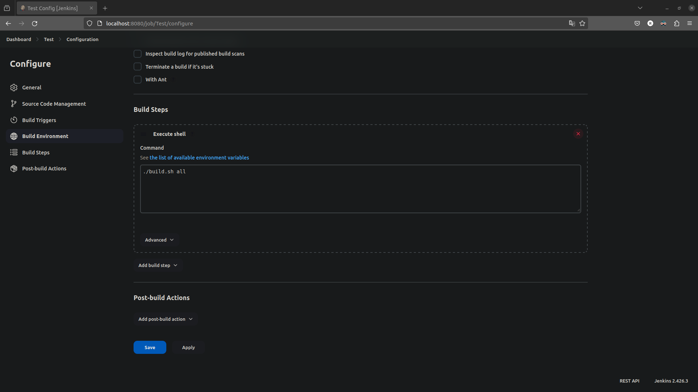
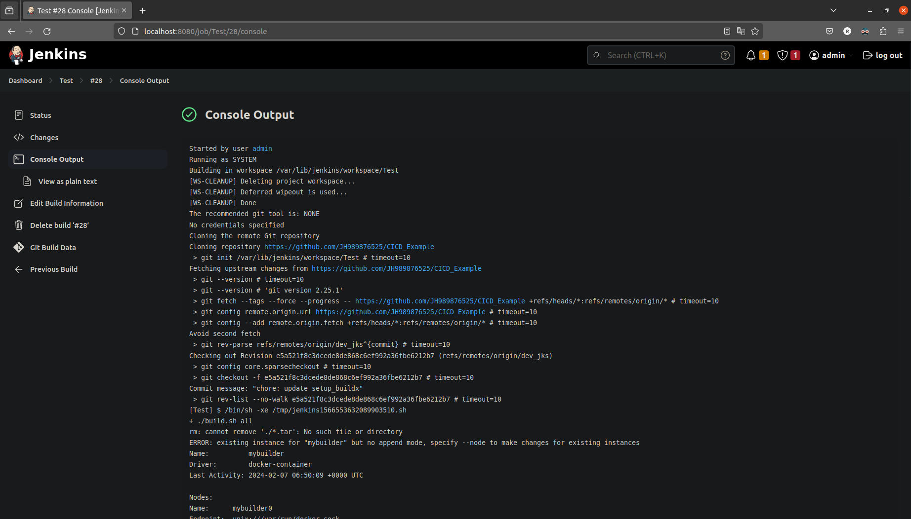

<!--
 Copyright (c) 2024 innodisk Crop.
 
 This software is released under the MIT License.
 https://opensource.org/licenses/MIT
-->

- [Overview](#overview)
- [Install jenkins](#install-jenkins)
- [Setup the project](#setup-the-project)
- [FAQ](#faq)


# Overview
This page shows a simple flow for jenkins.

# Install jenkins
1. Install jenkins.
    ```bash
    sudo wget -O /usr/share/keyrings/jenkins-keyring.asc \
    https://pkg.jenkins.io/debian-stable/jenkins.io-2023.key
    echo deb [signed-by=/usr/share/keyrings/jenkins-keyring.asc] \
    https://pkg.jenkins.io/debian-stable binary/ | sudo tee \
    /etc/apt/sources.list.d/jenkins.list > /dev/null
    sudo apt-get update
    sudo apt-get install jenkins
    ```
2. Setup & run systemd service.
    ```bash
    sudo systemctl start jenkins
    sudo systemctl status jenkins
    sudo systemctl enable jenkins
    ```
3. Open the url & install the suggest plugins
    ```url
    http://localhost:8080/
    ```

# Setup the project
- Link from private github repository.  
  
- Polling github repository, for example every 1 minute.  
  
- Setup build flow.  
  
- Success Result.  
  
  
# FAQ
- Jenkins run docker buildx `Docker exporter feature is currently not supported for docker driver. Please switch to a different driver.`  
    Because the user “jenkins” can not use the docker image of user “you” so add the docker buildx process into the build script for user “jenkins”.
    ```bash
    docker buildx create --name mybuilder --use
    docker buildx inspect mybuilder --bootstrap
    ```