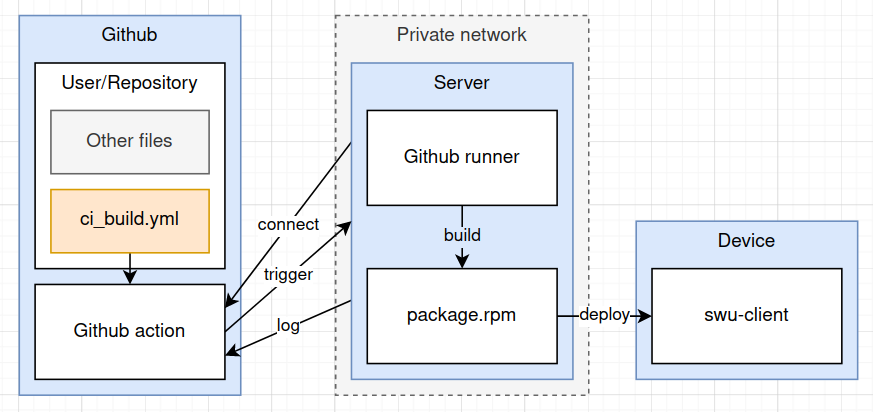

<!--
 Copyright (c) 2024 innodisk Crop.
 
 This software is released under the MIT License.
 https://opensource.org/licenses/MIT
-->

# Overview
This repo is a simple example for github action with local runner.



# FAQ
- How to run docker run without `sudo`.
  ```bash
  sudo groupadd docker
  sudo usermod -aG docker $USER
  sudo chmod 777 /var/run/docker.sock
  ```
- How to fix `Docker exporter feature is currently not supported for docker driver. Please switch to a different driver`.  
  Docker container `buildx` should be run without `sudo`.