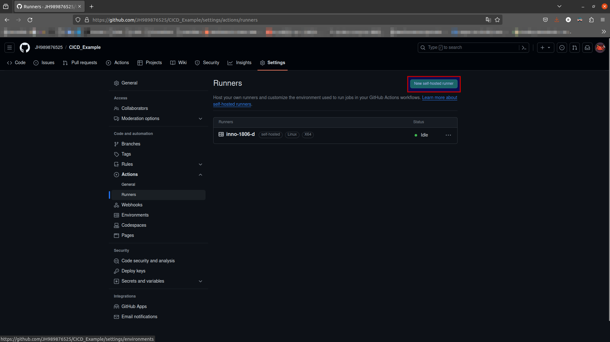
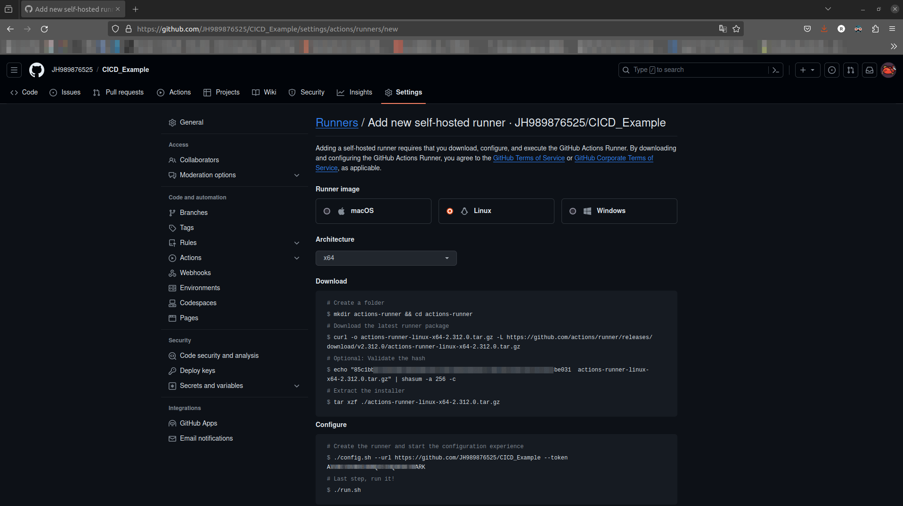
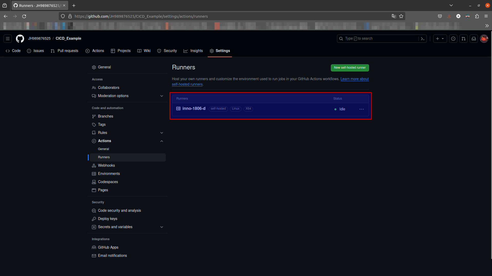
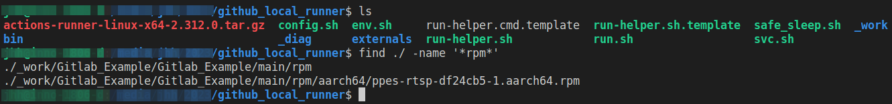

<!--
 Copyright (c) 2024 innodisk Crop.
 
 This software is released under the MIT License.
 https://opensource.org/licenses/MIT
-->

# Overview
This repo is a simple example for github action with local runner.


# Setup local runner
1. Open github settings page.
    
2. Setup local runner for github action step by step.
    
3. Check the status of runner on github settings page.
    
4. Add the `<action>.yml` into the project under `.github/workflows/`.
   ```yaml
    name: ci_build
    on:
    push:
        branches: [ main ]
    pull_request:
        branches: [ main ]

    jobs:
    build:
        runs-on: self-hosted
        steps:
        - name: Checkout
        uses: actions/checkout@v3
        with:
            path: main
        - name: Run
        run: cd main && ./build.sh all
   ```
5. Push the main branch to github then the github action will be triggered.
- The result will be saved in the runner folder.
    

# FAQ
- How to run docker run without `sudo`.
  ```bash
  sudo groupadd docker
  sudo usermod -aG docker $USER
  sudo chmod 777 /var/run/docker.sock
  ```
- How to fix `Docker exporter feature is currently not supported for docker driver. Please switch to a different driver`.  
  Docker container `buildx` should be run without `sudo`.

# Knowing issue
How to fix `Docker exporter feature is currently not supported for docker driver. Please switch to a different driver` on jenkins.